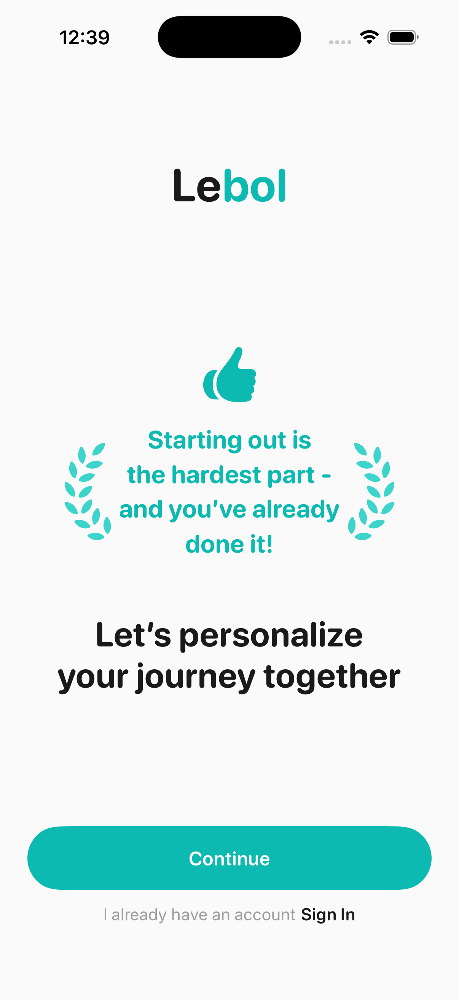
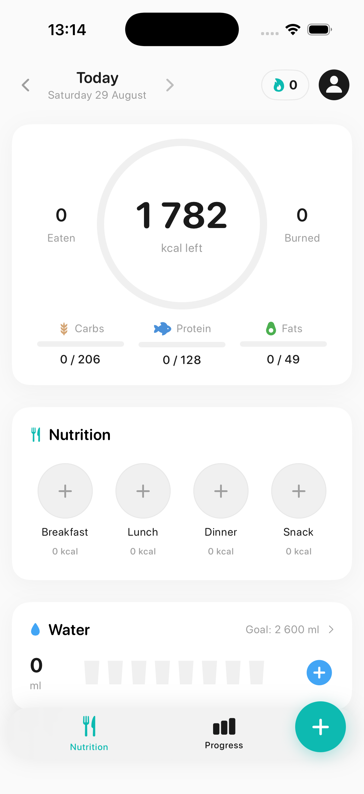

# Lebol

**An AI-assisted nutrition companion that makes food logging fast while keeping goals transparent.**


Lebol is an independent native iOS product prototype for people who want to lose weight without turning every meal into a data-entry task. It combines photo, voice, text, and search-based logging with transparent nutrition logic, local-first data, and personalized calorie, macro, hydration, activity, and weight goals.

<p align="center">
  
  
</p>

## Why I built it

Calorie tracking has a retention problem: the value compounds over time, but the input cost is immediate and repetitive. Lebol explores a simple product hypothesis:

> If logging a meal takes seconds and the resulting plan is easy to understand, more people will build a consistent feedback loop around nutrition.

The prototype is also an exercise in end-to-end product execution: understanding a category, choosing a focused MVP, translating nutritional research into deterministic logic, building a polished mobile interface, and integrating AI and cloud services without making them mandatory for the local experience.

## Product highlights

- Personalized onboarding with metric and imperial measurements
- Calorie and macro targets based on Mifflin-St Jeor, a dynamic activity model, and explicit safety floors
- Meal logging by photo, natural language, voice, food search, and favorites
- Editable AI estimates before anything is saved
- Daily dashboard for calories, macros, meals, hydration, and activity
- Weight history and goal progress
- Local-first persistence with SwiftData and schema migration support
- Optional authentication and cloud synchronization through Supabase
- 74 deterministic unit tests covering the core nutrition model

## Technical approach

| Layer | Implementation |
| --- | --- |
| UI | SwiftUI with a small reusable design system |
| State | Observation framework and MVVM-style view models |
| Persistence | SwiftData, relationships, and versioned migrations |
| Nutrition engine | Pure Swift functions with unit coverage |
| AI | Gemini 2.5 Flash through OpenRouter for structured multimodal extraction |
| Authentication | Supabase email and Apple identity-token exchange |
| Sync | Codable DTO boundary between SwiftData and Supabase |
| Platform | iOS 17+, Swift 5, Xcode 26.2 |

The core app works without accounts or API keys. Optional integrations degrade gracefully when they are not configured.

## Run locally

Requirements:

- macOS with Xcode 26.2 or a compatible newer version
- An iOS 17+ simulator

1. Clone the repository and open `Lebol/Lebol.xcodeproj`.
2. Select the `Lebol` scheme and an iPhone simulator.
3. Build and run.

No secrets are required for onboarding, the dashboard, manual tracking, or the nutrition engine.

To enable AI analysis or Supabase, copy `Lebol/Secrets.xcconfig.example` to `Lebol/Secrets.xcconfig` and provide the values you need:

```xcconfig
OPENROUTER_API_KEY =
SUPABASE_HOST = your-project.supabase.co
SUPABASE_ANON_KEY =
```

`Secrets.xcconfig` is ignored by Git. `Config.xcconfig` contains safe empty defaults, so a fresh clone still builds.

Run the tests from Xcode or from the command line:

```bash
xcodebuild test \
  -project Lebol/Lebol.xcodeproj \
  -scheme Lebol \
  -destination 'platform=iOS Simulator,name=iPhone 17,OS=26.2' \
  CODE_SIGNING_ALLOWED=NO
```

## Current status

Lebol is a working product prototype, not an App Store release and not a medical device.

| Area | Status |
| --- | --- |
| Onboarding, local tracking, dashboard, progress | Working |
| Nutrition calculation test suite | 74/74 passing |
| Photo, text, voice, and search analysis | Working with an OpenRouter key |
| Email authentication and Supabase sync | Implemented; requires a configured Supabase project and schema |
| Sign in with Apple | Implemented at code level; requires provider and signing-capability setup |
| Google sign-in | UI placeholder |
| Subscription/paywall | Not implemented |
| HealthKit | Planned |

## Security and privacy notes

- No credentials are committed to this repository.
- User nutrition data is stored locally by default.
- The current OpenRouter integration embeds a development key in the app bundle when configured. A production release must proxy AI requests through a rate-limited backend; shipping a provider key in a client app is not secure.
- A production Supabase deployment must enable and verify row-level security for every user-owned table.

## Disclaimer

Lebol provides estimates for demonstration purposes. It does not provide medical advice, diagnosis, or treatment. Nutrition targets and AI-generated food estimates should be reviewed and, where appropriate, discussed with a qualified healthcare professional.

## License

Lebol is available under the [MIT License](LICENSE).
